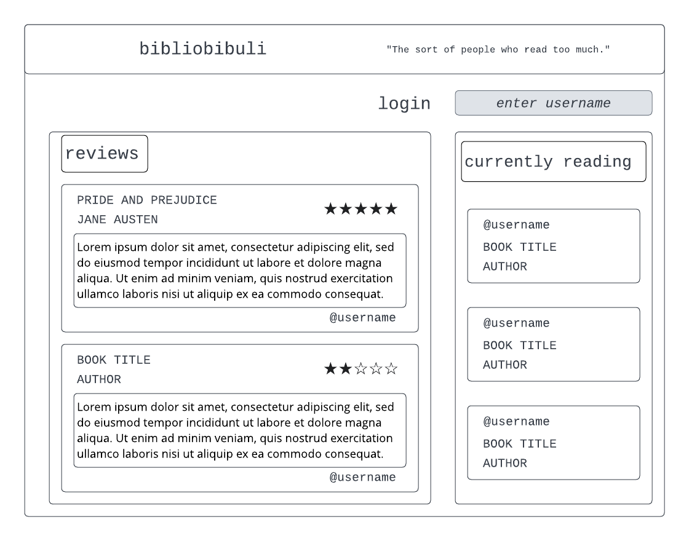

# startup

# design

Did you make a new year's resolution to read more books but aren't quite sure what to read? Do you love reading but need a place to keep track of your incredibly important opinions of the books you've read? We have just the app for you! Bibliobibuli allows you to share what book you are currently reading as well as see what others are reading. You can write reviews of the books you have read and see what others are saying about the books they've read. Get ready to read!

### Key Features
* secure login over HTTPS
* ability to list what book you're currently reading
* see what books others are reading
* rate a book and write a review
* see the book reviews of others
* reviews and currently reading are persistently stored

## Server IP Address (EC2)

http://18.216.215.40/

## Server Domain (Route 53)

https://riley260.click/

### Caddy/HTTPS
Made my web server communication secure through Caddy. 

### Github Assignment

I am modifying this for the first assignment!

GitHub assignment: I learned how to resolve merge conflicts!

### Simon HTML Assignment
- One of the main things that this assignment taught me was how to add hyperlinks to other pages on the website so that you can click on the link to see a different page. 
- Another thing that I learned on this assignment was how to use a header, main, and footer to set up a logical structure for the webpage. 

### CSS
- CSS Practice assignment: learned about selectors, declarations, fonts, and animations. 
