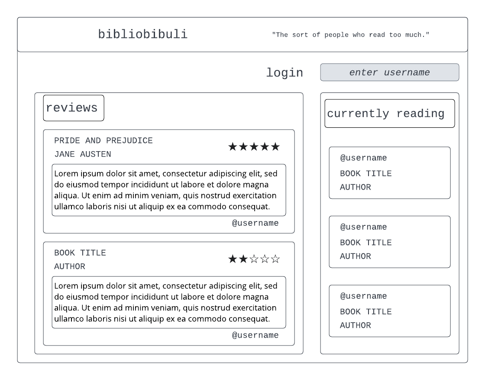

# startup

## design
Did you make a new year's resolution to read more books but aren't quite sure what to read? Do you love reading but need a place to keep track of your incredibly important opinions of the books you've read? We have just the app for you! Bibliobibuli allows you to share what book you are currently reading as well as see what others are reading. You can write reviews of the books you have read and see what others are saying about the books they've read. Get ready to read!



### Key Features
- secure login over HTTPS
- ability to list what book you're currently reading
- see what books others are reading
- rate a book and write a review
- see the book reviews of others
- reviews and currently reading are persistently stored

### Server IP Address (EC2)
http://18.216.215.40/

### Server Domain (Route 53)
https://riley260.click/

# Class Notes

### Github Assignment
I am modifying this for the first assignment!
GitHub assignment: I learned how to resolve merge conflicts!

## Web Servers

### The Internet
- big picture: internet is a collection of wires connecting all the computers in the world (a lot of the wires are wireless and not all computers are connected)
- to talk to another device, you have to have an IP address
- but humans prefer symbolic name, so domain names are converteed to IP addresses through a lookup in DNS (Domain Name System)
- `traceroute` shows the hops made in a connection
- TCP/IP Layers
  | Layer | Example | Purpose |
  | ----------- | --------------- | ------------------------------------- |
  | Application | HTTPS | Functionality like web browsing |
  | Transport | TCP | Moving connection information packets |
  | Internet | IP | Establishing connections |
  | Link | Fiber, hardware | Physical connections |

### Web Servers
- web server: computing device that hosts a web service that knows how to accept incoming internet connections and speak the HTTP application protocol
- service gateway (reverse proxy): a simple web service that listens on the common HTTP port 443; then it looks at the request and maps it to the other services running on different ports
- microservice: web service that provides a single functional purpose
- serverless: remove the server from the architecture conceptually and just write a function that speaks HTTP

### Domain Names
- `dig` allows you to get the IP address for any domain
- domain name: just a text string that follows specific naming convention and is listed in a special databas (domain name registry)
- root domain
  - secondary level domain and top level domain (TLD; such as com, edu, click)
  - example of root domain: byu.edu
  - can have any number of subdomains off the root domain (cs.byu.edu)
- `whois` allows you to see info about a domain name
- DNS database records
  - A (address) : straight mapping from domain name to IP address
  - CNAME (canonical name) : maps one domain name to another domain name (map byu.com to byu.edu)

### Caddy
- web service that listens to incoming HTTP requests and either serves up requested files or routes the request to another web service (Caddy is a service gateway)
- using Caddy for
  - handling creation/rotation of web certs (allows easy support of HTTPS)
  - serving up all static HTML, CSS, and JS files
  - acting as a gateway for subdomain requests to Simon and startup services

### HTTPS, TLS, and certificates
- HTTPS (Secure Hypertext Transport Protocol) is just HTTP but with secure connection that is negotiated before any data exchange
- all data is encrypted using TLS protocol
  - works by negotiating a shared secret that is used to encrypt data
- web certificates
  - generated by trusted 3rd party using public/private key encryption
  - issuer responsible for verifying cert owner actually owns the domain name represented
  - Caddy uses Let's Encrypt (allows you to create web certs for free)

## HTML

### Structure
- common elements: `body`, `header`, `footer`, `main`, `section`, `aside`, `p`, `table`, `ol/ul` ordered or unordered list, `div`, `span`
- block (distinct block in the structure) vs. inline (don't disrupt the flow of a block of content)

### Input
| Element    | Meaning                          | Example                                        |
| ---------- | -------------------------------- | ---------------------------------------------- |
| `form`     | Input container and submission   | `<form action="form.html" method="post">`      |
| `fieldset` | Labeled input grouping           | `<fieldset> ... </fieldset>`                   |
| `input`    | Multiple types of user input     | `<input type="" />`                            |
| `select`   | Selection dropdown               | `<select><option>1</option></select>`          |
| `optgroup` | Grouped selection dropdown       | `<optgroup><option>1</option></optgroup>`      |
| `option`   | Selection option                 | `<option selected>option2</option>`            |
| `textarea` | Multiline text input             | `<textarea></textarea>`                        |
| `label`    | Individual input label           | `<label for="range">Range: </label>`           |
| `output`   | Output of input                  | `<output for="range">0</output>`               |
| `meter`    | Display value with a known range | `<meter min="0" max="100" value="50"></meter>` |

- the purpose of a `form` element is to submit the inputs it contains (necessary before JavaScript)
- many different input types:
  - text: single line text value
  - password: obscured password
  - email
  - tel: telephone number
  - url: URL address
  - number
  - checkbox: inclusive selection
  - radio: exclusive selection
  - range: range-limited number
  - date: year, month, day
  - datetime-local: date and time
  - month: year, month
  - week: week of year
  - color
  - file: local file
  - submit: button to trigger form submission
- in order to create an input you have to specify the desired `type` attribute along with other attributed associated with that input type
- common input elemeent attributes
  - name: name of the input; submitted as the name of the input if used in a form
  - disabled: disables the user's ability to interact with the input
  - value: initial value for the input
  - required: requires that a value be entered
- `pattern` attribute exists for text, search, url, tel, email, and password inputs to provide a regex that has to match the input for it to be valid

### Media Elements
- external media: all media tags that reference external media take a URL as an attribute which can be either a relative or full path
  - image: `img` element has `src` attribute to specify URL to source image and `alt` attribute to describe the image
  - audio: `audio` element has `src` for the URL, `controls` if you want the user to be able to control playback, `autoplay` starts audio as soon as it is loaded, and `loop` keeps the audio playing over and over
  - video: `video` element has `src` for the URL, and `controls` and `autoplay` like audio
- internal media: allow you to create images directly in your HTML
  - `svg` (scalable vector graphics)
  - `canvas` (simple HTML for the canvas, but need JavaScript for drawing)

### Simon HTML Assignment
- One of the main things that this assignment taught me was how to add hyperlinks to other pages on the website so that you can click on the link to see a different page.
- Another thing that I learned on this assignment was how to use a header, main, and footer to set up a logical structure for the webpage.

## CSS
- three ways to associate CSS with HTML
  1. `style` attribute of HTML element and explicitly assign declarations
  2. use the HTML `style` element to define CSS rules within the HTML (should appear in the head element)
  3. use HTML `link` element to create hyperlink ref to external file containing CSS (must appear in head element)
- rules cascade down from highest nodes to lowest level (lower declaration overrides higher)
- box model
  - innermost box: contains the element's content
  - padding
  - border
  - margin: considered external to actual styling of box, only represents whitespace

### Selectors
- element type selector
  - element name selector (like `body`)
  - can use wildcard element name selector (`*`) to select all elements
- combinators
  - descendant combinator: defined with a space delimited list of values where each item in the list is a descendant of the previous item (`body section` = any section that is a descendant of a body)
  - child: a list of direct children (`section > p` = any p that is a direct child of a section)
  - general sibling: a list of siblings (`p ~ div` = any p that has a div sibling)
  - adjacent sibling: a list of adjacent siblings (`p + div` = any p that has an adjacent div sibling)
- class selector (`.class-name`): can also be combined with element name
- id selector (`#id`)
- attribute selector
  - allows you to choose elements based on their attributes
  - ex. `p[class='summary']`
- pseudo selector: select based on positional relationships, mouse interactions, hyperlink visitation states, attributes)

### Declarations
- specify a property and value to assign when the rule selector matches 1+ elements
  | Property | Value | Discussion |
  | ------------------ | ---------------------------------- | ------------------------------------------------------------------------------ |
  | background-color | color | Fill the background color |
  | border | color width style | Sets the border using shorthand where any or all of the values may be provided |
  | border-radius | unit | The size of the border radius |
  | box-shadow | x-offset y-offset blu-radius color | Creates a shadow |
  | columns | number | Number of textual columns |
  | column-rule | color width style | Sets the border used between columns using border shorthand |
  | color | color | Sets the text color |
  | cursor | type | Sets the cursor to display when hovering over the element |
  | display | type | Defines how to display the element and its children |
  | filter | filter-function | Applies a visual filter |
  | float | direction | Places the element to the left or right in the flow |
  | flex | | Flex layout. Used for responsive design |
  | font | family size style | Defines the text font using shorthand |
  | grid | | Grid layout. Used for responsive design |
  | height | unit | Sets the height of the box |
  | margin | unit | Sets the margin spacing |
  | max-[width/height] | unit | Restricts the width or height to no more than the unit |
  | min-[width/height] | unit | Restricts the width or height to no less than the unit |
  | opacity | number | Sets how opaque the element is |
  | overflow | [visible/hidden/scroll/auto] | Defines what happens when the content does not fix in its box |
  | position | [static/relative/absolute/sticky] | Defines how the element is positioned in the document |
  | padding | unit | Sets the padding spacing |
  | left | unit | The horizontal value of a positioned element |
  | text-align | [start/end/center/justify] | Defines how the text is aligned in the element |
  | top | unit | The vertical value of a positioned element |
  | transform | transform-function | Applies a transformation to the element |
  | width | unit | Sets the width of the box |
  | z-index | number | Controls the positioning of the element on the z axis |
- units to define the size of a CSS property
  - px: number of pixels
  - pt: points (1/72 of an inch)
  - in: inches
  - cm: centimeters
  - %: percentage of parent element
  - em: multiplier of width of the letter m in the parent's font
  - rem: multiplier of width of the letter m in the root's font
  - ex: multiplier of the height of the element's font
  - vw: percentage of viewport's width
  - vh: percentage of viewport's height
  - vmin: percentage of viewport's smaller dimension
  - vmax: percentage of viewport's larger dimension
- color
  - keyword: set of predefined colors (`cornflowerblue`)
  - RGB hex: red, green, and blue as hex (with optional alpha opacity)
  - RGB function: rgb as percentage or num 0-255, with optional alpha opacity (`rbg(50%, 255, 128, 0,5)`)
  - HSL: hue (position on 365 degree color wheel), saturation (how gray the color is), and light (how bright the color is) with optional opacity percentage (`hsl(180, 30%, 90%, 0.5)`)

### Fonts
- font families: `serif` (small stroke attached to ends of major strokes), `sans-serif` (no extra strokes), `fixed` (all chars same size), `symbol` (non-lang chars like emojis or arrows)
- importing fonts
  - use `@font-face` rule to provide font name and source location
  - instead of hosting font files on your server, you can load them from a font provider (easiest way is to use CSS import statement)

### Animation
- add `animation-name` and `animation-duration` properties to the element you want to animate
- create `@keyframes name { from{...} to{...}}`

### Responsive Design
- common options for `display`: none (don't display), block (displays with width that fills its parent element), inline (displays with width only as large as its content), flex, grid
- viewport meta tag
  - include this in head element of all HTML pages to tell the browser not to scale the page
  - `<meta name="viewport" content="width=device-width,initial-scale=1"/>`
- float: moves an element to the left or right of its container element and allows inline elements to wrap around it
- media queries
  - dynamically detects the size and orientation of the device and applies CSS rules accordingly
  - `@media (orientation: portrait) { ... }`

#### grid
- set `display` property of container element to `grid`
- property `grid-template-columns` specifies the layout of grid columns
- `grid-gap` sets the gap between grid items

#### flex
- helpful to partition application into areas that responsively move around as window resizes/orientation changes
- set `display` property of container element to `flex`
- choose orientation by setting `flex-direction` property
- in the children elements, set the property of `flex`
  - `flex: 1` means that the child gets one fractional unit of growth
  - `flex: 0 80px` means that it will not grow and that its starting height is 80px

### Debugging
- use Google Chrome debugger by right clicking on the HTML page element you want to debug and clicking `inspect` (use the Live Server extension in VS Code to pull it up in your browser)
- can change the values right in the debugger to allow you to see how the property is affecting the page

### Frameworks
- provide functions and components that commonly appear in web applications
- bootstrap
  - integrate bootstrap into your web apps by adding the HTML link elements to your head element
  - after it is linked in your HTML files, you can use the components it provides

### Simon CSS Assignment
- To show that a certain navigation bar item is selected, set the class of that link to "nav-link active" instead of just "nav-link"
- When you need to set multiple aspects of the margin to different things, you can just do `margin: top right bottom left` instead of assiging each value of margin in a separate line
- Using the `!important` rule overrides all previous styling rules for that property on that element

### UX Design
- Tools to help choose a color palette: [Paletton](https://paletton.com/) and [Adobe](https://color.adobe.com/create/color-wheel)
- Fonts
  - San Serif for buttons, navigation links, body text
  - Serif for paragraph headings
  - Monospaced for code examples or text that need alignment
  - [See Google's open font collection](https://fonts.google.com/about)
- Some icon packages: [Font Awesome](https://fontawesome.com/), [Bootstrap Icons](https://icons.getbootstrap.com/), [Material Icons](http://google.github.io/material-design-icons/), [Flat Color Icons](https://github.com/icons8/flat-color-icons), [Ant Design Icons](https://github.com/ant-design/ant-design-icons)

## JavaScript

### JavaScript Console
- log
  - `console.log('MSG');`
  - create formatted messages (i.e. `console.log('%s', 'MSG');`
  - specify CSS declarations too: `console.log(%c MSG', 'font-size:1.5em; color:green;');`
- timers allow you to see how long a piece of code runs for
```
console.time('NAME');
// code here
console.timeEnd('NAME');
// OUTPUT: NAME: 349.49 ms
```
- `count` is used to see how many times a block of code is called

### Type and Construct
- declaring variables
  - `let` allows you to change the value of the variable
  - `const` causes an error if you try to change it
- types
  - `Null`: a var that has not been assigned a value
  - `Undefined`: a var that has not been defined
  - `Boolean`: true or false
  - `Number`: 64-bit signed number
  - `BigInt`: number of arbitrary magnitude
  - `String`: textual sequence of characters
  - `Symbol`: a unique value
- common operators
  - numbers: + - \* / === (for equality)
  - strings: + (concatenation) and === (equality)
- type conversions
  - since JavaScript is a weakly typed language, a variable can change type when assigned a new value or converted based on the context it used in
  - some funny business happens using `==`, so use the STRICT equality and inequality operators (`===` and `!==`)
- conditionals
  - ternary operator: `CONDITION ? TRUE EXPR : FALSE EXPR;`
- loops (along with for, do while, and while)
  - `for in`: iterates over an object's property names
  - `for of`: iterates over an iterable's property values (array, map, set, etc)

### String
- can be surrounded by single or double quotes
- can also use a backtick (\`), but this defines a string literal that may contain JavaScript that is evaluated in place and concatenated to the string (the replacement specifier is the dollar sign followed by a curly brace pair and everything in the braces is evaluated as js)
- common functions: length, indexOf, split, startsWith, endsWith, toLowerCase

### Functions
- first class objects: can be assigned a name, passed as a param, returned as a result, and referenced from an object or array like any other variable
- parameters
  - if a parameter is not provided in the call, then that parameter has a value of `undefined` on execution
  - a function can define a default value `function fun(val, val2='default'){...}`
- anonymous functions

```
const add = function (a, b) {
    return a + b;
};
```

- inner functions: functions declared within other functions (modularize code without exposing private details)

### Arrow Functions
- curly braces are optional
- return keyword is optional if no curly braces are provided, but necessary if curly braces are used
- inherit the `this` pointer from the scope it is created in, which makes a `closure` (allows a function to continue referencing its creation scope even after it has passed from that scope)

```
// start with an anonymous function
(function (name) {
  return 'hello' + name;
});
// remove function and put arrow between arg and opening bracket
(name) => {
  return 'hello' + name;
}
// remove body brackets and return
(name) => 'hello' + name;
// remove param parentheses
name => 'hello' + name;
```

### Arrays
- a sequence of other objects and primitives
- common functions: `push`, `pop`, `slice` (returns a sub-array), `sort`, `values` (creates an iterator to use with a `for of` loop), `find` (finds the first item satisfied by a test function), `forEach` (run a function on each item in the array), `reduce` (runs a function to reduce each item to a single item), `map` (run a function to map the array to a new array), `filter` (run a function to remove items), `every` (run a funcion to test if all items match), `some` (run a function to see if any items match)

### Objects and Classes

#### objects
- represents a collection of name value pairs (i.e. properties)
- once an object is declared (with `new` operator) a property can be added by referencing the property name in an assignment
  - `obj.prop=VAL`
  - `obj['prop']=VAL`
- any type of variable can be assigned to a property
- object-literal syntax

```
const obj = {
    a : hello,
    b: 35,
};
```

- common functions: `entries` (returns array of key value pairs), `keys` (returns array of keys), `values` (returns array of values)
- constructor: any function that returns an object; can be invoked with `new`

#### classes
- look similar to declaring an object, but have an explicit constructor and assumed function declarations
- make properties and functions private by prefixing `#`

### JSON (JavaScript Object Notation)
- provides a simple and effective way to share and store data
  | Type | Example |
  | ------- | ----------------------- |
  | string | "crockford" |
  | number | 42 |
  | boolean | true |
  | array | [null,42,"crockford"] |
  | object | {"a":1,"b":"crockford"} |
  | null | null |
- convert to and from JSON with JSON.parse and JSON.stringify

### Regular Expressions
- regex support built into js
- can either use RegEx class constructor (`new RegEx('ab*', 'i')`) or regex literal (`/ab*/i`)
- `/pattern/modifiers;`
  - g: perform a global match (don't just stop after first match)
  - i: case-insensitive match
  - m: multiline matching

### Rest and Spread
- rest allows you to call a parameter with any number of parameters and it puts the parameters that aren't directly assigned to a parameter in an array
  - `function foo(param1, param2, ...others){...}`
- spread is the opposite of rest, it takes an object that is iterable and expands it to a function's params
  - `func(...[1, 2])` this will call func with a parameter of 1 and parameter of 2

### Destructuring
- pulls individual items out of an existing one
- can be done with arrays or objects
- with an array a: `[b, c] = a;` this line sets b to the first element and c to the second
  - combine multiple items from the original object using rest
- similar for objects, but you specify the property you want to pull from the source
  - `const o = {a: 1, b: 'hi', c: 4}; const {a, c} = o;`
  - can map names to new variables instead of just using original property names `const {a: count, b: type} = o;`

### Exceptions
- supports exception handling with `try catch` and `throw` syntax
- `finally` block also supported (always called when try block is exited, regardless if an exception was thrown)
- restrict exceptions to truly exceptional situations
- fallback pattern: put the normal feature path in try block and provide fallback implementation in catch block

### Scope
- four different kinds
  1. global: visible to all code
  2. module: visible to all code running in a module
  3. function: visible within a function
  4. block: visible within a block of code delimited by curly braces
- `var` was the original keyword to declare a variable, but it ignores block scope SO USE `let` or `const`
- `this`: represents a variable that points to an object containing the context within the scope of line currently being executed
  1. global: referenced outside a function or object it refers to the `globalThis` object, which is the context for runtime environment
  2. function: referenced inside a function it refers to the object that owns the function
  3. object: referenced in an object, it refers to the object
- closure: a function and its surrounding state
  - whatever variables are accessible when a function is created are available inside that function (even if you pass the function outside the scope of its orginal creation)

### Modules
- have to explicitly export the objects you want to be visible outside the module: `export function alertDisplay(msg) { alert(msg); }`
- import the exported function into another module using `import` : `import { alertDisplay } from './alert.js';`
- modules can only be called from other modules

### DOM (Document Object Model)
- object representation of the HTML elements the browser uses to render the display
- provide access to the DOM through global var named `document` that points to the root element of the DOM
- everything in an HTML documeent has a node in the DOM
- accessing DOM: you can provide a CSS selector to select elements from the document
  - `querySelector` returns the first element that matches the specified selector
  - `querySelectorAll` returns a list of the elements that match the selector
- modifying DOM
  - to create a new element, you first create the element on the DOM doc, then you insert the new element into the DOM tree by appending to an existing element
  ```
  function insertChild(parentSelector, text) {
    const newChild = document.createElement('div');
    newChild.textContent = text;
    const parentElement = document.querySelector(parentSelector);
    parentElement.appendChild(newChild);
  }
  insertChild('#courses', 'new course');
  ```
  - to delete element, call `removeChild` on the parent element
  ```
  function deleteChild(parentSelector) {
    const e1 = document.querySelector(parentSelector);
    e1.parentElement.removeChild(e1);
  }
  deleteChild('#courses div');
  ```
- injecting HTML
  - `const e1 = document.querySelector('div'); e1.innerHTML = '<div class="injected"><b>Hello</b>!</div>';`
  - make sure that if you inject HTML it cannot be manipulated by a user (either sanitize any HTML that contains variables or just use DOM manipulation)
- event listeners
  - all DOM elements support ability to attach a function that gets called when an event occurs on the element
  - this event listener gets called when an element gets clicked
    ```
    const submitDataE1 = document.querySelector('#submitData');
    submitDataE1.addEventListener('click', function (event) {
      console.log(event.type);
    });
    ```
  - common events: clipboard, focus, keyboard, mouse, text selection

### Promises
- JavaScript executes as a single threaded application (only one piece of code is executing at the same time), but you can asynchronously execute code with promises
- a promise object can be one of three states at any given time:
  1. pending: currently running asynchronously
  2. fulfilled: completed successfully
  3. rejected: failed to complete
- create by calling the promise object constructor and passing it an executor function to run the asynch operation
- resolving and rejecting
  - promise executor func takes two functions as parameters: `resolve` and `reject`
  - calling `resolve` sets the promise to `fulfilled` state and calling `reject` sets it to `rejected`
- then, catch, finally
  - `then` is called if the promise is fulfilled
  - `catch` is called if the promise is rejected
  - `finally` is always called after the processing is completed
- the observer pattern
  - another way to process asynchronously
  - while promises immediately begin to execute when the promise is created, observers form a pipeline that you can then pass an execution object into (makes observers reusable)

### Async/Await
- `await` wraps the execution of a promise and removes need to chain functions
- blocks until the promise state moves to fulfilled or throws an exception if it moves to rejected
- await can only be called in the top level of JavaScript OR in a function defined with `async` keyword
  - transforms the function so it returns a promise that resolves to the value the function previously returned
  - turns any function into an asynch function so it can make asynch requests

### Simon JS Assignment
- if the JS associated with an HTML page references HTML elements during initialization, the script needs to be located at the bottom of the HTML

## Web Services

### URL (uniform resource locator)
- represents the location of a web source (could be a web page, image, JSON object, gaming session, etc)
- follows this convention: `<scheme>://<domain name>:<port>/<path>?<parameters>#<anchor>`
  - scheme: protocol required to ask for the resource (ex: https)
  - domain name: the domain that owns the resource the URL represents (ex: byu.edu)
  - port: the numbered network port used to connect to the domain server; lower numbers are reserved for common internet protocols (ex: 3000)
  - path: the path to the resource on the domain (ex: /school/byu/user/woolfril)
  - parameters: represent a list of key value pairs that usually provides additional qualifiers on the resource represented by the path (ex: filter=names&highlight=intro)
  - anchor: represents a sub-location in the resource, sometimes called hash or fragment ID (ex: summary)
- URN (Uniform Resource Name) does not specify location information
- URI (Uniform Resource Identifier) can refer to eitheer a URL or URN

### Ports
- allow a single device to support multiple protocols and different types of services
- IANA (internet governing body) defines standard usage for port numbers
  - 0-1023: standard protocols
  - 1024-49151: ports assigned to requesting entities
  - 49152-65535: dynamic; used to create dynamic connections to a device
- some common port numbers
  - 20: FTP (file transfer protocol)
  - 22: SSH (secure shell)
  - 25: SMTP (simple mail transfer protocol)
  - 53: DNS (domain name system)
  - 80: HTTP
  - 110: POP3 (post office protocol) for retrieving email
  - 123: NTP (network time protocol)
  - 161: SNMP (simple network management protocol) for managing network devices such as routers or printers
  - 194: IRC (internet relay chat)
  - 443: HTTPS
- ports in the startup project
  - 22 allows us to SSH to open a remote console of the server
  - 443 is used for HTTPS and 80 for HTTP, but it redirects all request from port 80 to 443
  - internally our server can have as many web services running as we want, but we have to make sure each one uses a different port

### HTTP
- request syntax
  ```
  <verb> <url path, parameters, anchor> <version>
  [<header key: value>]*
  [
    <body>
  ]
  ```
- response syntax
  ```
  <version> <status code> <status string>
  [<header key: value>]*
  [
    <body>
  ]
  ```
- verbs
  - `GET`: get the requested resource; can request a single resource or a resource that represents a list of resources
  - `POST`: create a new resource; request body contains the resource; response should include the UID of new resource
  - `PUT`: update a resource; either path, header, or body must contain UID of resource to be updated; request body contains updated resource; response body may contain resulting updated resource
  - `DELETE`: delete a resource; either path or header must contain UID of resource to delete
  - `OPTIONS`: get metadata about a resource; usually only headers are returned, not the resource itself
- status codes
  - 1xx - informational
    - 100: Continue (the service is working on the request)
  - 2xx - success
    - 200: Success (requested resource was found and returned)
    - 201: Created (successfully created new resource)
    - 204: No Content (successful but no return resource)
  - 3xx - redirect to some other location, or the previously cached resource is still valid
    - 304: Not Modified (cached version of resource still valid)
    - 307: Permanent redirect (resource is no longer at request location, new location is in the response location header)
    - 308: Temporary redirect (resource is temporarily moved to different location, new location is in response location header)
  - 4xx - client errors (the request is invalid)
    - 400: Bad request (malformed or invalid request)
    - 401: Unauthorized (request didn't provide a valid auth token)
    - 403: Forbidden (provided auth token is not authorized for the resource)
    - 404: Not found (requested an unknown resource)
    - 408: Request timeout (request took too long)
    - 409: Conflict (provided resource represents an outdated version of the resource)
    - 418: I'm a teapot (server refuses to brew coffee because it is a teapot) (VERY IMPORTANT ONE)
    - 429: Too many requests (client is making too many requests too quickly)
  - 5xx - server errors (the request cannot be satisifed due to server error)
    - 500: Internal Server Error (server failed to properly process the request)
    - 503: Service Unavailable (server temporarily down)
- headers
  - `Authorization`: a token that authorizes the user making the request (ex: Bearer bdjfhsufe)
  - `Accept`: the content format the client accepts, can include wildcards (ex: image/\*)
  - `Content-Type`: format of the response content (ex: text/html; charset=utf-8)
  - `Cookie`: key value pairs that are generated by the server and stored on the client (ex: SessionID=dsrighsg;)
  - `Host`: domain name of the server, required in all requests (ex: info.cern.ch)
  - `Origin`: identifies where the request is coming from as hosts may only allow requests from specific places (ex: cs260.click)
  - `Access-Control-Allow-Origin`: server response of what origins can make a request, can include wildcards (ex: https://riley260.click)
  - `Content-Length`: number of bytes contained in the response (ex: 494)
  - `Cache-Control`: tells the client how it can cache the response (ex: public, max-age=385)
  - `User-Agent`: the client application that is making the request (ex: Mozilla/5.0 (Macintosh))
- cookies
  - HTTP is stateless (one request doesn't know anything about previous or futures requests) but a server/client can track state across requests through cookies
  - generated by a server and passed to client as a header
  - the client caches the cookie and returns it as a header in future requests

### SOP and CORS
- Same Origin Policy (SOP) only allows JavaScript to make requests to a domain if it is the same domain the user is currently viewing
- that helps with security, but makes it harder to build web applications
- Cross Origin Resource Sharing (CORS) allows the client to specify the origin of a request and then let the server respond with which origins are allowed
- if the server doesn't specify which origins are allowed, then the browser assumes it must only accept from the same origin
- to test if you can use a service before including it in your application, make sure it responds with \* or your calling origin

### Fetch
- fetch API is preferred way to make HTTP requests
- basic usage takes a URL and returns a promise; the `then` function takes a callback function that is called asynchronously when the requested content is obtained
- if the returned content is of the type `application/json` then you can use `json` function on the response object to convert it to a JS object

### Service Design
- model and sequence diagrams: model the application's primary objects and interactions of the objects and avoid introducing a model that is focused on programming constructs and infrastructure
- leveraging HTTP: since web services are usually provided over HTTP, it influences the design of the service; take advantage of this and other technologies instead of recreating the functionality they provide
- endpoints
  - a web service is usually split into multiple service endpoints, each one providing a single functional purpose
  - service endpoints called Application Programming Interface (API)
  - API can also refer to the entire collection of endpoints
  - things to consider when designing endpoints
    - grammatical: in HTTP, everything is a resource and is acted on by an HTTP verb
    - readable: the resource you're referencing with HTTP request should be clearly readable in the URL path
    - discoverable: so users of the endpoints only need to remember the top level endpoint and discover everything else, provide the endpoints for the aggregated resources (this is when you have resources that contain other resources)
    - compatible: build endpoints so that you can add functionality without breaking existing clients (usually this means your service's clients should just ignore whatever they don't understand)
    - simple: keep endpoints focused on the primary resources of the application; there should only be one way to act on a resource; endpoints should only do one thing
    - documented: create an initial draft of documentation before you begin coding to help mentally clarify your design
- three models for exposing endpoints
  - RPC (Remote Procedure Calls) [focus: function call]
    - exposes service endpoints as simple function calls
    - usually leverages the POST HTTP verb
    - actual verb and subject is represented by the function name (either the entire path of URL or parameter in POST body)
    - ```
      POST /updateOrder HTTP/2
      {"id": 2197, "date": "20230312"}
      ```
  - REST (Representational State Transfer) [focus: resource]
    - REST verbs always act on a resource
    - operations on a resource impact the state of the resource as it is transferred
    - the proper HTTP verb is used and the URL path uniquely identifies the resource
    - ```
      PUT /order/2197 HTTP/2
      {"date": "20230313"}
      ```
  - GraphQL [focuses on manipulation of data]
    - main part is a query that specifies the desired data and how it should be joined and filtered
    - helps remove a lot of logic for parsing endpoints and mapping requests to specific resources
    - think of there as only being one endpoint: the query endpoint
    - some downsides are that the client now has significant power to consume server resources and that it is difficult for the server to implement authorization rights to data

### Node.js
- first successful application for deploying JavaScript outside of a browser which means that JavaScript can power your entire technology stack
- loading a package using Node.js requires two steps: install the package locally on your machine using NPM (node package manager) and then include `require` statement in code that references the package name
- before you can use NPM to install packages, you have to initialize the code to use it: create a directory that will contain your JS and run `nmp init`, then it will ask you questions about the project (to accept defaults, run `npm init -y`)
- package.json
  1. metadata about your project (like its name and default js file)
  2. commands you can execute to do things like run, test, or distribute your code
  3. packages that this project depends on
- `npm <uninstall/install> <package name here>`
- adding a dependency adds package-lock.json and a directory named node-modules (contains the actual js for the package; DON'T check this directory into your source control system because it is very large and the information can be rebuilt from package files when you run `npm install` on the files)
- main steps to follow
  1. create project directory
  2. initialize it to be able to use NPM with `npm init -y`
  3. make sure `.gitignore` file contains `node-modules`
  4. install any desired packages with `npm install <package name>`
  5. add `require('<package name here>')`
  6. run the code with `node NAME.js`

### Express
- Node package that provides support for routing requests for service endpoints, manipulating HTTP requests with JSON body content, generating HTTP responses, and using middleware to add functionality
- create an Express application by installing Express package, calling express constructor, and listening for HTTP requests on a desired port
- defining routes
  - HTTP endpoints are implemented by defining routes that call a function based on an HTTP path
  - `get` function takes two parameters (URL path matching pattern and a callback function invoked when the pattern matches)
  - the callback function has three parameters (the HTTP request object, the HTTP response object, and the next routing function that Express expects to be called if this routing function wants another function to generate a response)
  - route path can include a limited wildcard syntax or full regular expressions in the path pattern
  - don't need to include `next` as a parameter if you are not calling it, but you cannot use middleware functions unless you call next
- using middleware
  - mediator/middleware design pattern
    - middleware represents componentized pieces of functionality
    - mediator loads middleware componeents and determines order of execution
    - Express is the mediator and middleware functions are the middleware components
  - Express has standard set of middleware functions (with functionality like routing, authentication, CORS, cookies, logging), some are default and some need to be installed; or you can declare your own middleware functions
  - looks really similar to routing functions because routing functions are also middleware functions
    - difference is that routing functions are only called if the pattern matches, but middleware functions are always called for every HTTP request as long as the preceding middleware function calls next
    - `function middlewareName(req, res, next)`
    - usually call the next function after completing processing so the next middleware function can go
  - the order you add middleware to the Express app object controls the order the functions are called
  - error handling middleware
    - can add middleware for handling errors
    - looks similar to other middleware, but with the additional err parameter containing the error

### Debugging Node
- debugging in VSCode:
  - `F5` starts the debugger and continues running from the current line when the debugger is running
  - `F10` steps to next line
  - `F11` steps into fucntion call
  - `SHIFT-F5` stops the debugger
- Nodemon
  - basically a wrapper around node that watches for files in the project directory to change and automatically restarts node when it detects you've saved something
  - have to create a launch configuration: `CMD-SHIFT-P`, `Debug: Add configuration`, `Node.js: Nodemon setup`, change program from `app.js` to whatever your JS file is

### PM2
- we want our services to keep running as daemon but we also want an easy way to start and stop our services
- already installed on our production server as part of AWS AMI and updated in deployment scripts
- to register a new web service
  - add the rule to Caddyfile (tells it how to direct requests for the domain)
  - create directory and add files for the web service
    - `node index.js 5000` starts up the web service, listening on port 5000
  - configure PM2 to host web service
    - in your service's directory, `pm2 start index.js -n SERVICE_NAME -- PORT#`
    - `pm2 save`

###  UI Testing
- UI testing is hard but necessary
- two solutions: 
  - automating the browser (Playwright)
    - Selenium first popular tool to automate the browser (but is slow and flaky)
    - install Playwright in project directory: `npm init playwright@latest`
    - put test in tests/ folder 
  - test various devices (BrowserStack)
    - allows you to select a physical device to run interactively or to use with Selenium
    - launching a device connects it to a physical device hosted in a data center 

### Endpoint Testing
- easier to test services than UI because it doesn't require a browser
- Jest 
  - `npm install jest -D` installs Jest as a development package
  - `npm run test`
- supertest (NPM package to make HTTP requests without sending them over the network)
- with TDD (test driven development) you can write your tests before you actually write your code
  - when the tests pass, then your code is complete
  - when you make modifications to the code, you know if you've broken something by running the tests again 

### Simon Service Assignment
- steps to convert Simon to a service
  1. move all previous deliverable code files (.html, .js, .css, favicon, asserts) into sub-directory named `public`
  2. configure the dir to work with node.js: `npm init -y`
  3. modify/create .gitignore to ignore node_modules
  4. install Express: `npm install express`
  5. create `index.js` in root of project as entry point for node.js
  6. add basic Express JS code to host application static content and desired endpoints
  7. modify Simon code to make service endpoint requests to the new service code 

### Storage Services
- don't store files directly on your server, but don't need a database service (that's overkill)
  - server has limited drive space (running out causes the application to fail)
  - consider your server as temporary (can be thrown away and replaced by a copy at any time)
  - need backup copies of application and user files 
- AWS S3
  - lots of advantages: unlimited capacity, only pay for storage you use, optimized for global access, multiple redundant copies of every file, can version the files ... etc
  - if you use AWS S3, make sure you don't include your credentials in your code or you'll get hacked and your AWS account will be taken over

### Data Services
- web applications commonly need to store application and user data persistently (usually a representation of complex interrelated objects)
- historically SQL databases have been used, but there are a lot of good options (each with their own specialty)
  - MySQL: relational queries
  - Redis: memory cached objects
  - ElasticSearch: ranked free text
  - MongoDB: JSON objects
  - DynamoDB: key value pairs
  - Neo4J: graph based data
  - InfluxDB: time series data
- MongoDB
  - think of it as a large array of JS objects, each with a unique ID
  - no strict schema requirements 
  - `npm install mongodb`
  - making a new `MongoClient` requires a uri that contains a username, password, and hostname
  - from that client, you can get a database object, and from that db object you can get a collection object
  - `insertOne` allows you to insert into the collection (mongo automatically creates the db or collection for you if they don't already exist)
  - `find` allows you to query for documents (it is asynchronous)
    - if you don't supply any parameters, it returns all documents in the collection
    - can pass it a query (like what value you want for a specific attribute) and options (for example: limit to first 10, sort in descending order)
  - KEEP YOUR KEYS OUT OF YOUR CODE
    - load your credentials when the application executes (a common way to do that is to read them from env variables)
      - access the environment in JS with `process.env`
      - set env variables for production environment by modifying the /etc/environment file after sshing into your production server
      - set env variables for development environment by adding the same variables into the ~/.zprofile file

#### Simon DB Assignment
- I LEARNED THAT YOU SHOULD USE deployService.sh NOT deployFiles.sh :smiling_face_with_tear:
- I think that it is so nice that Mongo will create the database/collection you are adding to if it doesn't already exist: very helpful!!

### Authorization Services
- you need a way to uniquely associate a user's data with a particular credential
- need to determine what a user is authorized to do within the application as well
- many service providers/package devs have created solutions to use for authentication and authorization
- use standard protocols for authenticating and authorizing (OAuth, SAML, OIDC) and support concepts like SSO (Single Sign On: allows you to use same credentials for multiple web applications) and Federated Login (allows you to login once and then that auth token is used to automatically log the user into multiple websites)

#### Account Creation and Login
- usually requires two endpoints: one to create the auth credential and another to authenticate the user on future visits
1. design service endpoints
2. build web service
3. handle requests
4. setup database connection
5. generate auth tokens
6. hash the passwords before storing 
7. pass auth tokens to browser to the endpoints

#### Simon Login Assignment
- secureApiRouter wraps the exisiting router and verifies the credentials for endpoints before passing the request to endpoints that require authorization (instead of apiRouter.get(...), use secureApiRouter.get(...))
- secure cookie to store the auth token for the user
  - `secure`: requires HTTP to be used when sending cookie back to server
  - `httpOnly`: tells the browser that JS running on the browser can't read the cookie
  - `sameSite`: only returns the cookie to the domain that generated it
- created service endpoints to store credentials and update the auth cookie: `authCreate`, `authLogin`, `authLogout`, `userGet`

### WebSocket
- fully duplexed: after the initial connection by the client using vanilla HTTP, upgrade to WebSocket by server which makes the relationship a peer to peer connection and either party can send data efficiently at any time
- still only between two parties, so to allow a conversation between a group of users the server has to act as the intermediary (the peers connect to the server and the server forwards the messages among the peers)
- create a WebSocket by specifying the port you want to communicate on 
  - then send messages with `send` and register a callback using `onmessage`
- specifying a port when you create the WebSocketServer tells the server to listen for HTTP connections on that port and automatically upgrade them to a WebSocket connection if the request has the `connection: Upgrade` header

#### Debugging WebSocket
- debug the server in VSCode
- debug the client in Chrome

#### [WebSocket Chat](https://github.com/webprogramming260/.github/blob/main/profile/webServices/webSocket/chat.md)

#### Simon WebSocket Assignment
- `npm install ws` to install WebSocket package
- attach a WebSocket listener to the HTTP server that was created earlier (this is done in the PeerProxy class)
- play.js file uses WebSocket in the functions for connecting, broadcasting, receiving, and displaying events 

## Web Frameworks

### React
- abstracts HTML into a JavaScript variate called JSX (this is converted to valid HTML and JavaScript using a preprocessor called Babel)

#### Components
- `render`: whatever is returned from this function is inserted into the component HTML element
- properties: allows you to pass information to components (they receive them in their constructor and can deisplay the properties when it renders)
- state
  - call the React.useState hook function
  - returns a variable that contains the current state and a function to update the state 
  - can use function style and class style (though function style is preferred)
    - in class style: properties are loaded in through the constructor and the sate is set using a setState function on the component object
- whenever a component's state or properties change, the render function for the component is called, as well as the render functions for all of its dependent components
